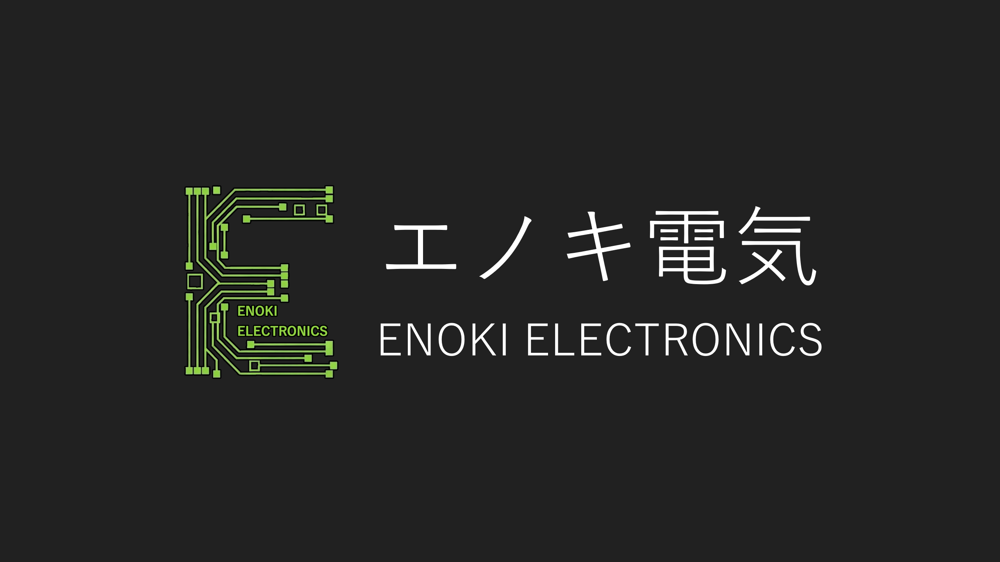

# エノキ電気（ときえのき） の Github へようこそ

これは、趣味で音楽を作っている人がプログラミングをやってみた記録です。
音楽もプログラミングも好きだがバイクも好きだし食えるもんは全部食う精神

## 何ができる？

| YouTube 音楽                                                                                               | YouTube 電気                                                                                               |
| ---------------------------------------------------------------------------------------------------------- | ---------------------------------------------------------------------------------------------------------- |
|  |  |

## My Websites & My Apps

- ホームページ <https://enoki.xyz>
- Google Play Store <https://play.google.com/store/apps/dev?id=8940000495375956936&hl=ja>
- Twitter <https://enoki.xyz/twitter>
- 自作 SNS <https://ec.enoki.xyz>
- 個人事業主向け報酬管理 <https://uber.enoki.xyz>
- Android 音楽プレイヤーアプリ <https://dopamine.enoki.xyz>
- マリオみたいなゲーム <https://github.com/jikantoki/super3>
- パチンコみたいなゲーム <https://github.com/jikantoki/yukkuri-monogatari>

## Github status

  
  

  
  

## History

2003 年 生まれる  
2015 年 頃 Aviutl C Bash VBScript Terapad  
2017 年 HSP AndroidROM 焼き、TWRP 導入、FRP 解除 ボカロ P として活動開始  
2020 年 自作 Linux ディストリビューション「Caramel OS」公開 WordPress IT パスポート取得 マリオ風ゲーム「Super3」公開 Ubuntu-Server Raspberry-Pi Arduino  
2021 年 個人事業主として届出提出  
2022 年 PHP Javascript JQuery MySQL Apache  
2023 年 自作 SNS 公開 Node.js Vue Git C# Terapad から VSCode に乗り換え 中小 IT 企業で働き始める  
2024 年 学生終了、結局フリーのギグワーカーになる（後に個人事業主として某企業に所属）  
2024 年 夏 業務委託で某社に所属  
2026 年 Google Play Storeでの配信を開始
